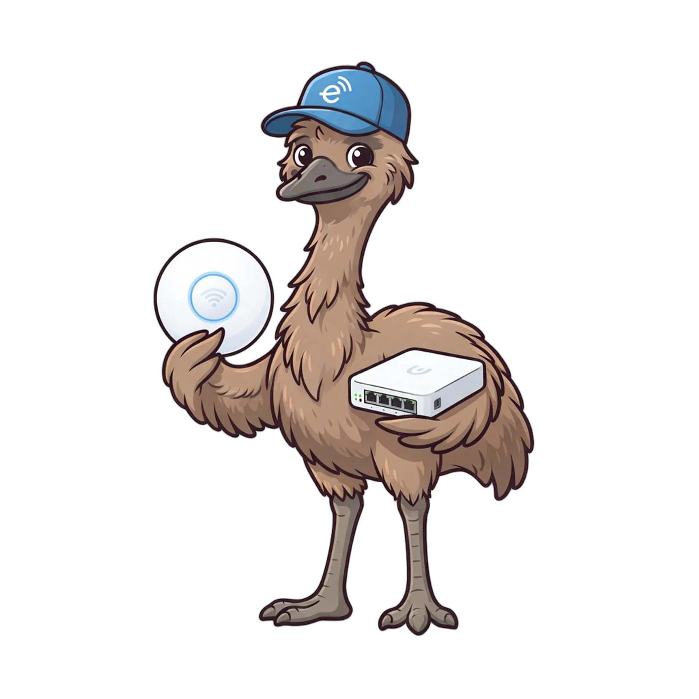

# unifi-emu

<p align="center">
  
</p>

**Fake UniFi devices that speak the inform protocol and get adopted by a real
controller.** A device simulator/emulator for integration testing — give a UniFi
controller a fleet of deterministic, controllable APs / switches / gateways
without any hardware.

`emu` = emulator (and a flightless bird that struts around pretending it belongs).

## Status

🐓 **Fully fledged.** A live-proven fleet — 1 gateway, 2 switches, 2 APs —
adopts all the way to CONNECTED against a real controller
(`ghcr.io/jamesbraid/unifi-network:sim`), including a controller-requested
firmware "upgrade" survived with an emulated reboot. Shipped:

- **Library** (`package emu`) — fleet API: `New/Add/Start/State/WaitState/Stop`.
- **CLI** (`cmd/unifi-emu`) — single-device flags, `-devices` file, or
  `SIM_DEVICES` env (YAML/JSON).
- **Container image** — `docker build -t unifi-emu:dev .` (static, scratch,
  ~9MB). The live suite builds this image from the checkout.
- **Adopt helpers** — classic Network App (`ClassicClient`) and UniFi OS
  ucore/CSRF (`UOSClient`), live-proven against the published seeded UOS
  image through its controller-requested AP firmware upgrade.
- **Consumer integrations** — `AdoptDevice` + `StartDeviceSim` in go-unifi's
  controllertest (jamesbraid/go-unifi#16) and a compose sidecar in
  terraform-provider-unifi (jamesbraid/terraform-provider-unifi#11).

Not yet: the module/image aren't published anywhere (both PRs note it).

### Quick start

```sh
go test ./... # unit tests, no container runtime needed
go test -tags integration -run TestClassicUGWLive -v -count=1 .
go test -tags integration -run TestClassicFleetLive -v -count=1 .
go test -tags integration -run TestUOSAPUpgradeLive -v -count=1 .
docker build -t unifi-emu:dev . && docker run --rm unifi-emu:dev -h
```

The live tests use `testcontainers-go`. Each test creates an isolated network,
a fresh controller, and an emulator container built from the checkout.
Controller APIs use random host ports. Inform traffic stays on the container
network. Logs and device documents remain under `tmp/itest/<test-name>/`.

Set `UNIFI_EMU_ITEST_EMULATOR_IMAGE` to test a prebuilt emulator instead.
`UNIFI_EMU_ITEST_CLASSIC_IMAGE` and `UNIFI_EMU_ITEST_UOS_IMAGE` select
controller images. Defaults are `ghcr.io/jamesbraid/unifi-network:sim` and
`ghcr.io/jamesbraid/unifi-os-server:seeded`.

The newer UOS path uses a fresh seeded controller and proves the negotiated
CBC-to-AES-GCM transition and AP firmware upgrade. Its controller healthcheck
stays enabled. The harness also waits for seeded-owner and API readiness.

### Model registry

| Model | Type | Firmware |
|---|---|---|
| UGW3 | gateway | 4.4.36.5146617 |
| USWED74 | switch | 4.0.21.9965 |
| USM8P | switch (PoE) | 4.0.21.9965 |
| US48P750 | switch (PoE) | 4.0.21.9965 |
| USWED06 | switch | 4.0.21.9965 |
| USWF07D | switch | 4.0.21.9965 |
| U7MP | access point | 4.0.21.9965 |
| U7PRO | access point | 4.0.21.9965 |
| UAPA6B0 | access point | 4.0.21.9965 |

The registry is generated, not hand-shaped. [`model_profiles.json`](model_profiles.json)
is the checked-in reduced fixture and `go generate ./...` renders
`models_generated.go` from it. The fixture records the source controller
version and keeps the complete expanded port and radio layouts so review diffs
show every hardware change.

To refresh it from a controller build, save:

- `GET /api/s/default/stat/device` for model IDs, names, types, and firmware;
- the controller UI's `swai.*.js` bundle, which contains its hardware database.

Then run:

```sh
go run ./cmd/modelgen \
  -input stat-device.json \
  -device-db-bundle swai.js \
  -controller-version 10.4.57
go test ./...
```

The reducer rejects missing models, duplicate IDs or ports, type mismatches,
unknown port encodings, empty layouts, and incomplete AP radio data. The
controller also exposes `GET /v2/api/site/default/models`; that endpoint is
useful for identity/image metadata but does not include port or radio layouts.
The few facts absent from both dumps (AP Ethernet speed/count and radio spatial
streams) follow Ubiquiti's Tech Specs for
[AC Mesh Pro](https://techspecs.ui.com/unifi/wifi/uap-ac-mesh-pro),
[U7 Pro](https://techspecs.ui.com/unifi/wifi/u7-pro),
[U7 Pro Outdoor](https://techspecs.ui.com/unifi/wifi/u7-pro-outdoor-us), and
[Ultra](https://techspecs.ui.com/unifi/switching/usw-ultra).

## More

- [`docs/DESIGN.md`](docs/DESIGN.md) — what it is, the verified inform-protocol
  facts, architecture, and how it plugs into `go-unifi` / `terraform-provider-unifi`.
- [`docs/BUILD-PROMPT.md`](docs/BUILD-PROMPT.md) — the kickoff plan for the first
  build phase (a gateway that adopts to CONNECTED).

## The one hard rule

Devices enter a controller **only through the real inform/adoption lifecycle** —
no MongoDB/DB seeding. DB-injected devices render permanently disconnected; the
whole point of this tool is real, connected, adoptable devices.

## License

MIT — see [LICENSE](LICENSE).
