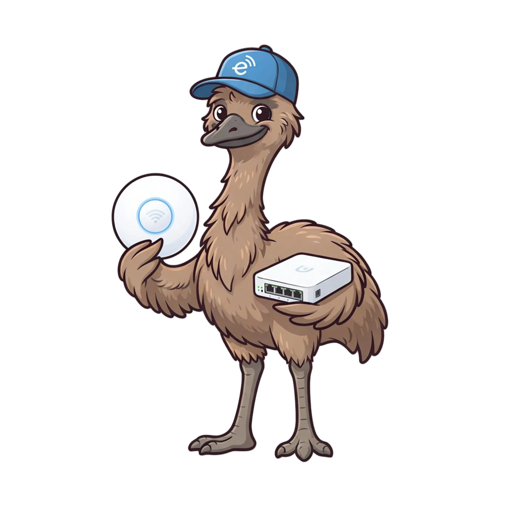

# unifi-emu

<p align="center">
  
</p>

**Fake UniFi devices that speak the inform protocol and get adopted by a real
controller.** A device simulator/emulator for integration testing — give a UniFi
controller a fleet of deterministic, controllable APs / switches / gateways
without any hardware.

`emu` = emulator (and a flightless bird that struts around pretending it belongs).

## Status

🐓 **Fully fledged.** A live-proven fleet — 1 gateway, 2 switches, 2 APs —
adopts all the way to CONNECTED against a real controller
(`ghcr.io/jamesbraid/unifi-network:sim`). On UniFi OS an emulated AP also
survives a controller-requested firmware "upgrade" by faking the reboot.
Shipped:

- **Library** (`package emu`) — fleet API: `New/Add/Start/State/WaitState/Stop`.
- **CLI** (`cmd/unifi-emu`) — single-device flags, a full `-devices` file /
  `SIM_DEVICES` env (YAML/JSON), or a terse `-models` / `SIM_MODELS` list
  (`U7PRO,USM8P:2,UGW3`) that auto-derives MAC/IP.
- **Container image** — `docker build -t unifi-emu:dev .` (static, scratch,
  ~10MB). Bakes the 5-device fleet as its default, so a bare `docker run`
  boots it. `-e SIM_MODELS=…`, `-e SIM_DEVICES=…`, or the flags override it.
  The live suite builds this image from the checkout.
- **Self-adoption** — `-adopt` makes the container adopt what it informs, so
  a consumer in any language gets connected devices without writing an adopt
  client. Live-proven on the classic Network App
  (`TestClassicContainerAdoptLive`). The UniFi OS ucore/CSRF dialect shares
  that client, but no test drives it from a container yet.
- **Consumer integrations** — `AdoptDevice` + `StartDeviceSim` in go-unifi's
  controllertest (jamesbraid/go-unifi#16) and a compose sidecar in
  terraform-provider-unifi (jamesbraid/terraform-provider-unifi#11).

### Getting it

The image lives on GHCR — multi-arch (`linux/amd64`, `linux/arm64`), scratch,
anonymously pullable — and the module is on the Go proxy. Image tags drop the
`v` that module tags keep:

```sh
docker pull ghcr.io/jamesbraid/unifi-emu:0.3   # also :0.3.1, :latest
go get github.com/jamesbraid/unifi-emu@v0.3.1
```

`-adopt` is **not in a release yet**. The newest tag is 0.3.1, which informs
only. Build the image from the checkout until the next tag ships.

### Quick start

```sh
go test ./... # unit tests, no container runtime needed
go test -tags integration -run TestClassicUGWLive -v -count=1 .
go test -tags integration -run TestClassicFleetLive -v -count=1 .
go test -tags integration -run TestClassicContainerAdoptLive -v -count=1 .
go test -tags integration -run TestUOSAPUpgradeLive -v -count=1 .
docker build -t unifi-emu:dev . && docker run --rm unifi-emu:dev -h
```

The image boots its baked default fleet, and any explicit source overrides it:

```sh
docker run --rm unifi-emu:dev -inform http://CTRL:8080/inform                 # baked 5-device fleet
docker run --rm -e SIM_MODELS=U7PRO,USM8P:2,UGW3 unifi-emu:dev -inform …       # pick models (MAC/IP auto)
docker run --rm -e SIM_DEVICES="$(cat my-fleet.yaml)" unifi-emu:dev -inform …  # full control
```

`SIM_MODELS` takes a count per model (`USM8P:2` = two of them) and derives
each device's MAC/IP from `SIM_MAC_BASE`/`SIM_IP_BASE` (defaults
`00:27:22:e0:00:00` / `192.168.1.100`). A fleet may hold one gateway at most.

## Adopting from the container

Without `-adopt` the devices inform and sit pending, waiting for someone to
click Adopt. With it, the container logs into the controller API and adopts
them itself, so nothing outside needs an adopt client:

```sh
docker run --rm --network unifi \
  -e SIM_ADOPT=1 \
  -e SIM_ADOPT_URL=https://controller:8443 \
  -e SIM_ADOPT_USERNAME=admin -e SIM_ADOPT_PASSWORD=admin \
  unifi-emu:dev -inform http://controller:8080/inform
```

### Settings

Every flag reads its default from the matching variable, so an explicit flag
beats the environment and both beat the built-in default. Credentials have no
flag: a password in `argv` shows up in every process listing.

| Variable | Flag | Default | Meaning |
|---|---|---|---|
| `SIM_ADOPT` | `-adopt` | off | Adopt the fleet after it informs. |
| `SIM_ADOPT_URL` | `-adopt-url` | — | Controller **API** URL. Required. |
| `SIM_ADOPT_USERNAME` | — | — | Controller login. Required. |
| `SIM_ADOPT_PASSWORD` | — | — | Its password. Required. |
| `SIM_ADOPT_PASSWORD_FILE` | — | — | Read the password from this file instead. |
| `SIM_ADOPT_SITE` | `-adopt-site` | `default` | Site to adopt into. |
| `SIM_ADOPT_DIALECT` | `-adopt-dialect` | from the URL port | `classic` or `unifios`. |
| `SIM_ADOPT_TIMEOUT` | `-adopt-timeout` | `5m` | Budget for the whole adoption. |

The container refuses to start when a setting is missing or malformed,
because one that informs but silently never adopts looks exactly like one
that is merely slow. Setting any `SIM_ADOPT_*` variable without `SIM_ADOPT`
is an error for the same reason. To override an environment that turns
adoption on, pass `-adopt=false`.

### Two things that trip people up

**The adopt URL is the API port**, not the inform port: 8443 on the classic
Network App, 443 on UniFi OS. The container therefore needs to reach both
ports — 8080 to inform, and the API port to adopt.

**The dialect is a guess about a port**, not a fact about the controller. Port
443 gives `unifios` and anything else gives `classic`. The container logs
which way it resolved. Set `-adopt-dialect` when the guess is wrong, as it
will be for a controller behind a proxy.

### Adoption behaviour

Devices adopt one at a time. Controllers reject bursts and reject documents
that are only seconds old, so adopting in sequence finishes sooner than
adopting in parallel.

The container tolerates a controller that is still booting. Informing retries
forever, and login retries for as long as `-adopt-timeout` allows. A service
that starts ahead of its controller therefore adopts as soon as that
controller answers. Rejected credentials still fail on the first answer,
instead of burning the budget.

Restarting against a controller that still holds the fleet succeeds, leaving
the already-adopted devices alone.

Failure is fatal and loud. When a device never reaches connected inside
`-adopt-timeout`, the container reports what the controller thought of every
device, stops the fleet, and **exits non-zero**. Success is quiet: the
container keeps running and informing, exactly as it does without `-adopt`,
until you stop it.

### As a CI service

Compose and Woodpecker start services before the test step, so the emulator
informs and adopts on its own while the pipeline waits for connected devices.

```yaml
services:
  - name: emu
    image: unifi-emu:dev
    environment:
      SIM_CONTROLLER: http://controller:8080/inform
      SIM_MODELS: U7PRO,USM8P:2
      SIM_ADOPT: "1"
      SIM_ADOPT_URL: https://controller:8443
      SIM_ADOPT_SITE: default
      SIM_ADOPT_TIMEOUT: 10m
      SIM_ADOPT_USERNAME: admin
      SIM_ADOPT_PASSWORD:
        from_secret: controller_password
```

`SIM_CONTROLLER` replaces the `-inform` flag, so the block needs no command.
Where the runner mounts secrets as files rather than variables, point
`SIM_ADOPT_PASSWORD_FILE` at the path instead. Give `SIM_ADOPT_TIMEOUT` room
for the controller to boot and the fleet to adopt: the default 5m suits a
controller that is already up, and a cold one can spend most of that starting.

## Integration tests

The live tests use `testcontainers-go`. Each test creates an isolated network,
a fresh controller, and an emulator container built from the checkout.
Controller APIs use random host ports. Inform traffic stays on the container
network. Logs and device documents remain under `tmp/itest/<test-name>/`.

Set `UNIFI_EMU_ITEST_EMULATOR_IMAGE` to test a prebuilt emulator instead.
`UNIFI_EMU_ITEST_CLASSIC_IMAGE` and `UNIFI_EMU_ITEST_UOS_IMAGE` select
controller images. Defaults are `ghcr.io/jamesbraid/unifi-network:sim` and
`ghcr.io/jamesbraid/unifi-os-server:seeded`.

The UOS path boots a fresh seeded controller and proves the negotiated
CBC-to-AES-GCM transition and the AP firmware upgrade. Before starting a
test, the harness waits for that container's healthcheck, its seeded owner,
and its API.

## Model registry

The registry covers the full current UniFi AP / switch / gateway lineup —
**182 models** at controller 10.4.57. [`model_profiles.json`](model_profiles.json)
is the checked-in reduced catalog, embedded with `go:embed` and parsed at
startup. There is no generated Go to commit, so `go build` and `go test` need
no extra step.

`cmd/modelgen` builds the catalog from a controller's hardware database plus a
couple of Ubiquiti sources. The bundle isn't in git, so refreshing needs a
controller — a deliberate step, not part of the build. Harvest the UI's
`swai.*.js` bundle (every model's ports and radios) and
`.../dl/firmware/bundles.json` (display names) from a controller, then fetch
Ubiquiti's `firmware-latest` and device `fingerprint` JSON. Then:

```sh
# real AP ethernet from Tech Specs, written into model_overrides.json
go run ./cmd/modelgen -fetch-eth -bundle swai.js -fingerprint fingerprint.json

# generate the catalog
go run ./cmd/modelgen -bundle swai.js -bundles-json bundles.json \
  -firmware-json firmware-latest.json -overrides model_overrides.json \
  -controller-version 10.4.57
go test ./...
```

Firmware versions come from Ubiquiti's fw-update API, joined on the model code.
AP Ethernet — which the hardware DB omits — comes from Tech Specs, matched to the
fingerprint DB by model code and then by hardware sysid (so the hex-coded 10GbE
flagships resolve). Facts the bundle can't express live in
[`model_overrides.json`](model_overrides.json). A model the bundle can't render —
an unknown radio band, say — is skipped and logged, never emitted wrong. An AP
with no resolved ethernet keeps a 1×GbE default, also logged.

## More

- [`docs/DESIGN.md`](docs/DESIGN.md) — what it is, the verified inform-protocol
  facts, architecture, and how it plugs into `go-unifi` / `terraform-provider-unifi`.
- [`docs/BUILD-PROMPT.md`](docs/BUILD-PROMPT.md) — the kickoff plan for the first
  build phase (a gateway that adopts to CONNECTED).

## The one hard rule

Devices enter a controller **only through the real inform/adoption lifecycle** —
no MongoDB/DB seeding. DB-injected devices render permanently disconnected. The
whole point of this tool is real, connected, adoptable devices.

## License

MIT — see [LICENSE](LICENSE).
